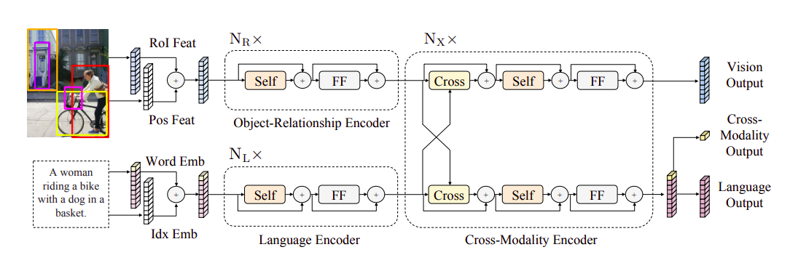

# Adaptively Finetuning LXMERT



## Data, Environment Setup and Running Instructions

Detailed instructions for data and environment setup, installing the pre-trained models and executing the code can be found in [lxmert\_readme](./lxmert_readme.md). Currently, this repository supports the adaptive finetuning experiments on the VQAv2 and VQA-CPv2 datasets only.

Summary: The following command can be used to execute the code on VQAv2 dataset with single GPU training

```sh
bash run/vqa_finetune.bash 0 <version> --strategy=<finetuning strategy>
```

Where ``<version>`` is the string describing the run and ``<finetuning strategy>`` can be from ``standard``, ``SpotTune`` and ``SpotTune_Block``. The checkpoints will be stored in the ``snap/vqa/<version>`` directory.

## Results and Visualizations

Results on the VQAv2 dataset.

Finetune Strategy | Train Accuracy | Val Accuracy | Generalization Error |
| ----------------- | -------------- | ------------ | -------------------- |
| Frozen Backbones     | 75.57          | 68.92        | 6.65                 |
| Standard          | 84.52          | 69.92        | 14.50                |
| SpotTune          | 81.42          | 69.72        | 11.70                |
| SpotTune\_Block   | 81.58          | 69.53        | 12.05                |

### Visualizations for SpotTune 

Sample visualization for SpotTune strategy on LXMERT-Base trained on VQAv2 dataset.

| Epoch Number | Usage of Finetuned Blocks |
| ------------ | ------------------------- |
| 4 |  |

### Visualizations for SpotTune\_Block

Sample visualization for SpotTune_Block strategy on LXMERT-Base trained on VQAv2 dataset.

| Epoch Number | Usage of Finetuned Blocks |
| ------------ | ------------------------- |
| 4 |  |

## Wandb
The link for the project can be found [here](https://wandb.ai/shnik/adaptive-finetuning-lxmert?workspace=user-shnik).
